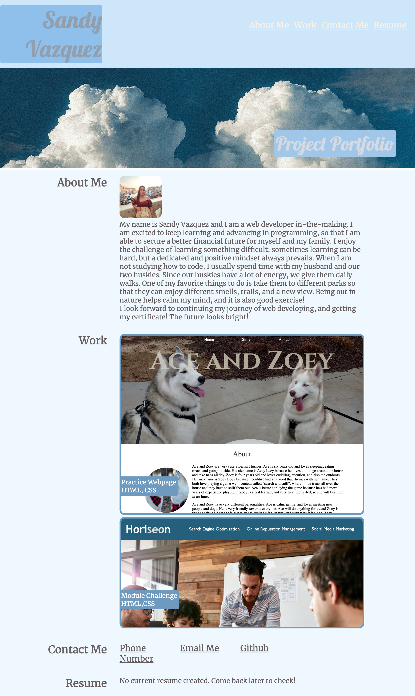

---Module 2 Challenge---
This week's challenge consisted of creating a professional portfolio to hold our work for possible employers to see. One of the main focuses in the project was to make the portfolio easy to navigate. This was accomplished by creating links that worked properly, and by organizing the webpage layout to flow nicely.
First, I created the HTML file from scratch, having the mock-up webpage as reference. Lastly, I added styling to the referenced CSS file. Below is a screenshot of my professional portfolio. 

